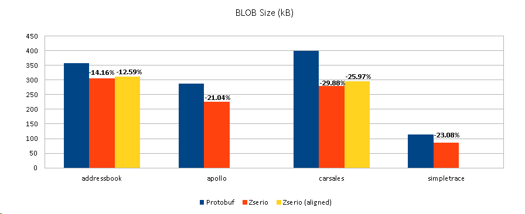

# Protobuf Benchmarks by Zserio

[](https://github.com/ndsev/zserio-protobuf-benchmarks/actions/workflows/build_linux.yml)
[](https://github.com/ndsev/zserio-protobuf-benchmarks/actions/workflows/build_windows.yml)
[](https://GitHub.com/ndsev/zserio-protobuf-benchmarks/watchers)
[](https://GitHub.com/ndsev/zserio-protobuf-benchmarks/network/members)
[](https://GitHub.com/ndsev/zserio-protobuf-benchmarks/stargazers)

--------

Protobuf Benchmarks by Zserio is an independent benchmark which uses
[zserio-datasets](https://github.com/ndsev/zserio-datasets) to compare Google's
[Protocol Buffers](https://github.com/protocolbuffers/protobuf) performance to [Zserio](http://zserio.org/)
on the same sets of data.

## Zserio vs. Protocol Buffers

Google's Protocol Buffers are very popular and in wide-spread use. One of the many questions we always have to
answer is: "Why don't you use Protobuf? It is already there."

Fact is that it wasn't open sourced when we would have needed it. Maybe we would have used it back then. But
even today we think we came along with something more tailored to our needs. This is also the reason why we
open sourced Zserio after such a long time.

So let's see how Zserio performs in comparison to Protobuf. For being fair we have chosen as well the example
that is used on Google's documentation page of Protobuf (`addressbook`). This example does not really help
to promote a binary - thus smaller - representation of data. It mostly uses strings.

## Running

Make sure you have the following pre-requisites installed:

- Protocol Buffers Compiler
- CMake
- ZIP utility
- Supported Compiler (gcc, clang, mingw, msvc)

Also do not forget to fetch the datasets with `git submodule update --init`.

Now you are ready to run the `benchmark.sh` script which accepts the required platform as a parameter 
(e.g. `cpp-linux64-gcc`):

```
scripts/benchmark.sh <PLATFORM>
```

The script `benchmark.sh` automatically generates simple performance test for each benchmark.
The performance test uses generated Protocol Buffers' API to read appropriate dataset from JSON format,
serialize it into the Protocol Buffers' binary format and then read it again. Both reading time and the BLOB
size are reported. BLOB size after zip compression is reported as well.

## Results

- Used platform: 64-bit Linux Mint 21.1, Intel(R) Core(TM) i7-9850H CPU @ 2.60GHz
- Used compiler: gcc 11.3.0

### Protobuf 3.21.12

[addressbook.proto]: https://github.com/ndsev/zserio-protobuf-benchmarks/blob/master/benchmarks/addressbook/addressbook.proto
[apollo.proto]: https://github.com/ndsev/zserio-protobuf-benchmarks/blob/master/benchmarks/apollo/apollo.proto
[carsales.proto]: https://github.com/ndsev/zserio-protobuf-benchmarks/blob/master/benchmarks/carsales/carsales.proto
[simpletrace.proto]: https://github.com/ndsev/zserio-protobuf-benchmarks/blob/master/benchmarks/simpletrace/simpletrace.proto

[addressbook.json]: https://github.com/ndsev/zserio-datasets/blob/master/addressbook/addressbook.json
[apollo.proto.json]: https://github.com/ndsev/zserio-datasets/blob/master/apollo/apollo.proto.json
[carsales.json]: https://github.com/ndsev/zserio-datasets/blob/master/carsales/carsales.json
[prague-groebenzell.json]: https://github.com/ndsev/zserio-datasets/blob/master/simpletrace/prague-groebenzell.json

| Benchmark            | Dataset                   | Target               |      Time | Blob Size | Zip Size |
| -------------------- | ------------------------- | -------------------- | --------- | --------- | -------- |
| [addressbook.proto]  | [addressbook.json]        | C++ (linux64-gcc)    |   1.731ms | 356.292kB |    193kB |
| [apollo.proto]       | [apollo.proto.json]       | C++ (linux64-gcc)    |   0.641ms | 286.863kB |    136kB |
| [carsales.proto]     | [carsales.json]           | C++ (linux64-gcc)    |   2.053ms | 399.779kB |    242kB |
| [simpletrace.proto]  | [prague-groebenzell.json] | C++ (linux64-gcc)    |   0.386ms | 113.152kB |     54kB |

### Zserio 2.10

[addressbook.zs]: https://github.com/ndsev/zserio/blob/master/benchmarks/addressbook/addressbook.zs
[addressbook_align.zs]: https://github.com/ndsev/zserio/blob/master/benchmarks/addressbook/addressbook_align.zs
[apollo.zs]: https://github.com/ndsev/zserio/blob/master/benchmarks/apollo/apollo.zs
[apollo.zs.json]: https://github.com/ndsev/zserio-datasets/blob/master/apollo/apollo.zs.json
[carsales.zs]: https://github.com/ndsev/zserio/blob/master/benchmarks/carsales/carsales.zs
[carsales_align.zs]: https://github.com/ndsev/zserio/blob/master/benchmarks/carsales/carsales_align.zs
[simpletrace.zs]: https://github.com/ndsev/zserio/blob/master/benchmarks/simpletrace/simpletrace.zs

| Benchmark              | Dataset                   | Target              |      Time | Blob Size | Zip Size |
| ---------------------- | ------------------------- | ------------------- | --------- | --------- | -------- |
| [addressbook.zs]       | [addressbook.json]        | C++ (linux64-gcc)   |   1.478ms | 305.838kB |    222kB |
| [addressbook_align.zs] | [addressbook.json]        | C++ (linux64-gcc)   |   0.844ms | 311.424kB |    177kB |
| [apollo.zs]            | [apollo.zs.json]          | C++ (linux64-gcc)   |   0.244ms | 226.507kB |    144kB |
| [carsales.zs]          | [carsales.json]           | C++ (linux64-gcc)   |   1.374ms | 280.340kB |    259kB |
| [carsales_align.zs]    | [carsales.json]           | C++ (linux64-gcc)   |   0.925ms | 295.965kB |    205kB |
| [simpletrace.zs]       | [prague-groebenzell.json] | C++ (linux64-gcc)   |   0.221ms |  87.042kB |     66kB |

### Time Comparison


### Size Comparison



## Why Is Zserio More Compact Than Protobuf?

To be fair, it is necessary to note that Protobuf encodes more information which are used
for compatibility of encoder/decoder when proto file is changed:

- Protobuf encodes each field ID (i.e. the = 1, = 2 in the following messages example), to preserve
  compatibility when adding new fields or reordering them in messages:

  ```
  message Road
  {
    int32 id = 1;
    string name = 2;
  }
  ```

  These IDs have an encoding cost, which zserio does not pay. In zserio, it would merely be:

  ```
  struct Road
  {
    int32 id;
    string name;
  };
  ```
- Protobuf always encodes the field size, so that old decoders can skip field IDs which they do not know about.
  This is useful for forward/backward compatibility. This has a cost which zserio does not pay.

On another hand, zserio encoder uses better compactness:

- Zserio can have fields of arbitrary bit size, non-byte aligned, unlike protobuf which has fewer possible
  types, all byte aligned. And structures (messages) are not byte aligned in general (although explicit
  alignment is possible e.g. `align(8)`)
- Zserio has constraint expressions to indicate whether a field is encoded or not based on previously decoded
  information. The constraint expression has zero cost in encoding size since it's only present in the generated
  encoding/decoded code. In the following example, the box field is only encoded iff and expression following it
  is true, based on previously decoded info, which helps being compact:

  ```
  struct Foo
  {
    int8 type;
    BoundingBox box if type == 1;
  };
  ```

  The encoding size of such structure in zserio would be only 1 byte (which may not be byte aligned) for the
  type field.
- Arrays in zserio do not need to encode the size of the array. It's known in the generated encoding/decoding
  code, even for arrays of variable size as in the following example. When size is zero in particular, the array
  has zero encoding cost:

  ```
  struct Foo
  {
    int8 num_items;
    Items list[num_items];
  };
  ```

  In protobuf, this would be a repeated field, but the repeated field always has an encoding cost to encode its
  length as for every other fields in protobuf, to be able to skip it:

  ```
  message Foo
  {
    int8 num_items = 1;
    repeated Items list = 2;
  }
  ```

## How to Add New Benchmark

- Add new dataset (e.g. `new_benchmark`) in JSON format
  into [datasets repository](https://github.com/ndsev/zserio-datasets)
- Add new schema (e.g. `new_benchmark`) in Protobuf format into
  [benchmarks directory](https://github.com/ndsev/zserio-protobuf-benchmarks/tree/master/benchmarks)
- Make sure that the first message in the schema file is the top level message
